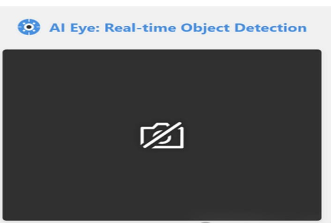
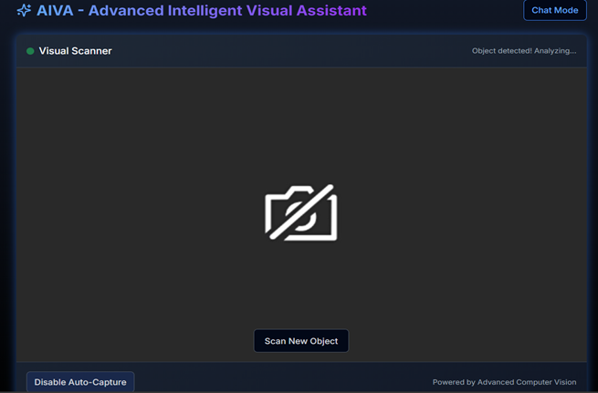
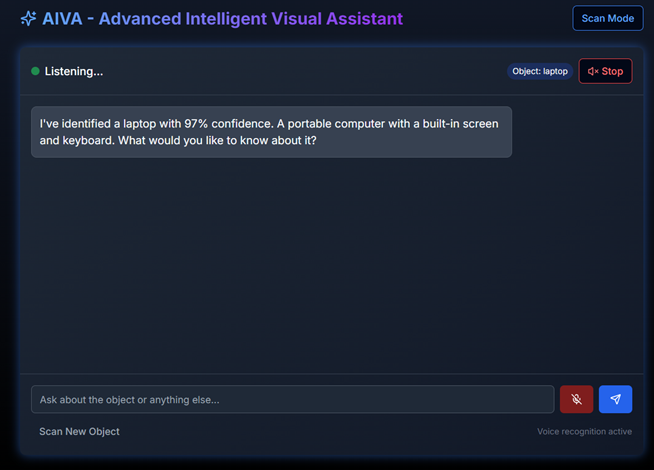
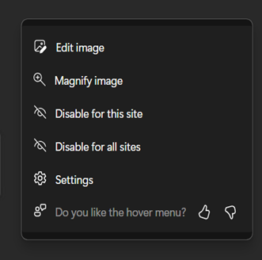

# 🥗 Smart AI for Personalized Nutrition and Consumer Insights

<p align="center">
  <b>AI-powered food analysis and nutrition assistance using computer vision and Python.</b>
</p>

<p align="center">
  
  
  
  
</p>

---

## 📌 About The Project

**Smart AI for Personalized Nutrition and Consumer Insights** is an AI-powered food analysis system designed to help users understand the nutritional information of food through image-based analysis.

The system captures a food image using a webcam, identifies food items, estimates portion size, retrieves nutritional information, and provides the results to the user.

The application also includes voice-based assistance, making the interaction more accessible and user-friendly.

The project demonstrates the integration of **Computer Vision, Python, Nutrition APIs, Portion Estimation, and Voice Assistance** into an intelligent nutrition-support system.

---

## 🎯 Objectives

- 🍎 Identify food items from captured images
- 📷 Capture food images using a webcam
- 📏 Estimate the portion size of detected food
- 🥗 Retrieve nutritional information
- 🔊 Provide voice-based nutrition assistance
- 📊 Present useful nutritional information to users
- 🤖 Demonstrate AI-assisted food and nutrition analysis

---

## ✨ Key Features

### 📷 Food Image Capture

The system captures food images using a webcam as the input for the analysis pipeline.

### 🍎 Food Detection

The application processes the captured image and identifies food items for further nutritional analysis.

### 📏 Portion Estimation

The system estimates the portion size of the detected food to support more meaningful nutrition analysis.

### 🥗 Nutrition Analysis

Nutritional information is retrieved for detected food items and displayed to the user.

### 🔊 Voice Assistant

The application provides voice-based feedback for detected food, portion information, and nutritional details.

### 🤖 Integrated AI Pipeline

Multiple components are connected together to create an automated food-analysis workflow.

## 📸 Screenshots

### 👁️ AI Eye – Real-Time Object Detection



---

### 🤖 AIVA – Visual Scanner



---

### 💬 AIVA – Chat Mode



---

### 🖼️ Visual Assistant Interface



---

## 🔄 System Workflow

```text
             ┌─────────────────────┐
             │      User           │
             └──────────┬──────────┘
                        │
                        ▼
             ┌─────────────────────┐
             │  Webcam Capture     │
             │  Food Image         │
             └──────────┬──────────┘
                        │
                        ▼
             ┌─────────────────────┐
             │   Food Detection    │
             └──────────┬──────────┘
                        │
                        ▼
             ┌─────────────────────┐
             │ Portion Estimation  │
             └──────────┬──────────┘
                        │
                        ▼
             ┌─────────────────────┐
             │ Nutrition Analysis  │
             └──────────┬──────────┘
                        │
                        ▼
             ┌─────────────────────┐
             │  Nutrition Results  │
             └──────────┬──────────┘
                        │
                        ▼
             ┌─────────────────────┐
             │  Voice Assistance   │
             └─────────────────────┘
```

🧠 AI & Computer Vision Pipeline

The application follows a sequential processing pipeline:

```

Food Image
    │
    ▼
Image Capture
    │
    ▼
Food Detection
    │
    ▼
Portion Estimation
    │
    ▼
Nutrition Lookup
    │
    ▼
Nutrition Details
    │
    ▼
Voice Feedback

```
The main application connects the webcam capture, food detection, portion estimation, nutrition lookup, voice assistant, and result-display components.

🛠️ Technologies Used
Programming Language
Python
Computer Vision
OpenCV
AI / Food Analysis
Food Detection
Image Processing
Portion Estimation
Nutrition
Nutrition API
Nutritional Data Processing
Voice Assistance
Python-based Voice Assistant

📂 Project Structure

```

smart-ai-nutrition-system/
│
├── app.py
├── food_detector.py
├── nutrition_api.py
├── portion_estimator.py
├── voice_assistant.py
├── webcam_capture.py
├── utils.py
├── requirements.txt
│
└── README.md

```
📄 File Description
```
| File                   | Description                         |
| ---------------------- | ----------------------------------- |
| `app.py`               | Main application pipeline           |
| `food_detector.py`     | Food detection module               |
| `nutrition_api.py`     | Retrieves nutrition information     |
| `portion_estimator.py` | Estimates food portion size         |
| `voice_assistant.py`   | Provides voice-based feedback       |
| `webcam_capture.py`    | Captures food images through webcam |
| `utils.py`             | Utility functions                   |
| `requirements.txt`     | Python dependencies                 |

```
🔄 Application Pipeline

The main application performs the following steps:

Step 1 – Capture Image

The webcam is used to capture an image of the food.

Step 2 – Detect Food

The captured image is passed to the food detection module.

Step 3 – Estimate Portion

The system estimates the portion size of the detected food.

Step 4 – Retrieve Nutrition

Nutritional information is obtained for the detected food item.

Step 5 – Display Results

Nutrition details such as calories and other available nutritional information are presented.

Step 6 – Voice Assistance

The system provides voice feedback about the detected food and nutritional information.

⚙️ Installation & Setup

1️⃣ Clone the Repository
git clone https://github.com/Aiswarya-RS/smart-ai-nutrition-system.git

Navigate into the project: cd smart-ai-nutrition-system

2️⃣ Create a Virtual Environment
python -m venv venv
Activate the environment.
Windows
venv\Scripts\activate
Linux / macOS
source venv/bin/activate

3️⃣ Install Dependencies
pip install -r requirements.txt

4️⃣ Run the Application
python app.py

Make sure your webcam is connected and accessible before starting the application.

📊 Example Output

The system processes a captured food image and provides information such as:

Detected Foods: Apple

Portion Size: [Estimated Portion]

Nutrition for Apple

Calories: [Nutrition API Result]

The voice assistant can also provide feedback about the detected food and its nutritional information.

🌱 Future Enhancements
🧠 Integrate a trained deep learning food-classification model
🍕 Support a larger number of food categories
📊 Provide detailed nutrition dashboards
👤 Add personalized user profiles
🥗 Generate personalized meal recommendations
📈 Track daily calorie and nutrition intake
📱 Develop a mobile application
☁️ Deploy the application as a cloud-based service
🔊 Improve multilingual voice assistance
📋 Add nutrition history and progress tracking
🎓 Project Highlights

This project demonstrates practical implementation of:

Computer Vision
Python Programming
Image Processing
Food Detection
Portion Estimation
Nutrition API Integration
Voice Assistance
Modular Software Design
AI-Assisted Nutrition Analysis
👩‍💻 Author
Aiswarya R S

Computer Science Engineering Student | Java Developer | AI Enthusiast

<p align="center"> <a href="https://github.com/Aiswarya-RS">  </a> <a href="https://www.linkedin.com/in/aiswarya-r-s-a65a19374/">  </a> <a href="mailto:aiswaryaram025@gmail.com">  </a> </p>
⭐ Project Repository
<p align="center"> <a href="https://github.com/Aiswarya-RS/smart-ai-nutrition-system">  </a> </p>
⚠️ Disclaimer

This project is developed for educational and research purposes.

The nutritional information provided by the system is intended for general informational purposes and should not be considered professional medical or dietary advice.

Users should consult qualified healthcare or nutrition professionals for personalized dietary guidance.
